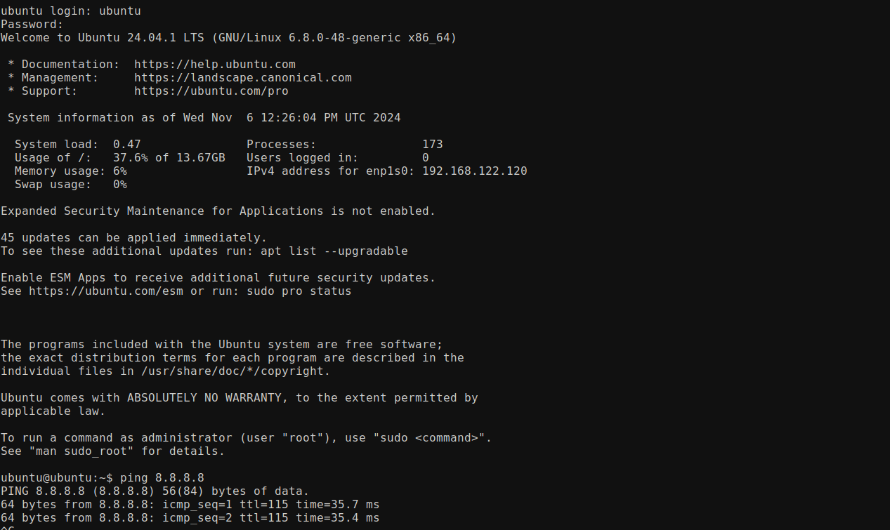
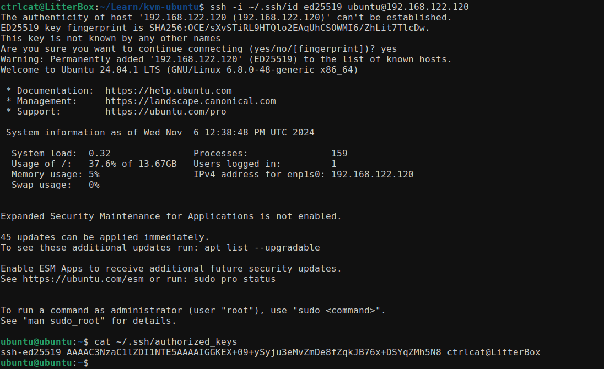

# Unattended Installation of Ubuntu 24.04.1 Server on KVM

## Prerequisites

- Ubuntu 24.04.1 Server ISO at same level as the main script (Optional, will download using `wget` if not found)
- `user-data` and `meta-data` files at same level as the main script.

1. Check if your CPU supports hardware virtualization

```bash
kvm-ok
```

Only proceed if the output is `INFO: /dev/kvm exists`.

2. Download the cloud image for Ubuntu 24.04.1 Server

3. Create the disk image for the virtual machine

```bash
qemu-img create -f qcow2 ubuntu-24.04.1.qcow2 25G
```

4. Run the script

```bash
sudo sh kvm.sh
```

CLI after running the script and successful ubuntu installation:



5. Find the IP address of the virtual machine

From the host:

```bash
virsh net-dhcp-leases default
```

From inside the virtual machine:

```bash
ifconfig | grep -Eo 'inet (addr:)?([0-9]*\.){3}[0-9]*' | grep -Eo '([0-9]*\.){3}[0-9]*' | grep -v '127.0.0.1' | awk '{print "IP Address: "$1}'
```

6. Logging to the virtual machine using SSH

```bash
ssh -i ~/.ssh/id_ed25519 <username>@<ip-address>
```



## Errors

1. `vmlinuz` not found at Step 4 (Not always)

```bash
Enabling and Starting Libvirt Service...
● libvirtd.service - Virtualization daemon
     Loaded: loaded (/lib/systemd/system/libvirtd.service; enabled; vendor preset: enabled)
     Active: active (running) since Wed 2024-11-06 17:20:14 +0545; 43min ago
TriggeredBy: ● libvirtd.socket
             ● libvirtd-ro.socket
             ● libvirtd-admin.socket
       Docs: man:libvirtd(8)
             https://libvirt.org
   Main PID: 229709 (libvirtd)
      Tasks: 22 (limit: 32768)
     Memory: 64.4M
        CPU: 7.932s
     CGroup: /system.slice/libvirtd.service
             ├─  1497 /usr/sbin/dnsmasq --conf-file=/var/lib/libvirt/dnsmasq/default.conf --leasefile-ro --dhcp-script=/usr/lib/libvirt/libvirt_leaseshelper
             ├─  1498 /usr/sbin/dnsmasq --conf-file=/var/lib/libvirt/dnsmasq/default.conf --leasefile-ro --dhcp-script=/usr/lib/libvirt/libvirt_leaseshelper
             └─229709 /usr/sbin/libvirtd

Nov 06 17:21:10 LitterBox dnsmasq-dhcp[1497]: DHCPACK(virbr0) 192.168.122.16 52:54:00:80:4c:92 ubuntu-server
Nov 06 17:24:23 LitterBox libvirtd[229709]: libvirt version: 8.0.0, package: 1ubuntu7.10 (Marc Deslauriers <marc.deslauriers@ubuntu.com> Fri, 12 Apr 2024 13:48:21 -0400)
Nov 06 17:24:23 LitterBox libvirtd[229709]: hostname: LitterBox
Nov 06 17:24:23 LitterBox libvirtd[229709]: cannot parse process status data
Nov 06 17:24:23 LitterBox libvirtd[232383]: 2024-11-06 11:39:23.320+0000: 232383: info : libvirt version: 8.0.0, package: 1ubuntu7.10 (Marc Deslauriers <marc.deslauriers@ubuntu.com> Fri, 12>
Nov 06 17:24:23 LitterBox libvirtd[232383]: 2024-11-06 11:39:23.320+0000: 232383: info : hostname: LitterBox
Nov 06 17:24:23 LitterBox libvirtd[232383]: 2024-11-06 11:39:23.320+0000: 232383: warning : virSecurityDACTransactionRun:283 : Ignoring failed restore attempt on /var/lib/libvirt/images/ubu>
Nov 06 17:24:23 LitterBox libvirtd[229709]: internal error: child reported (status=125): unable to stat: /var/lib/libvirt/boot/virtinst-oi2d3j63-vmlinuz: No such file or directory
Nov 06 17:24:23 LitterBox libvirtd[229709]: unable to stat: /var/lib/libvirt/boot/virtinst-oi2d3j63-vmlinuz: No such file or directory
Nov 06 17:24:23 LitterBox libvirtd[229709]: Unable to run security manager transaction
```

Didn't affect the installation, but needed intervention (Ctrl + C).

2. Failed unmounting cdrom.mount - /cdrom at Step 4.

```bash
start: subiquity/Shutdown/shutdown: mode=REBOOT
[FAILED] Failed unmounting cdrom.mount - /cdrom.
[  381.770796] (sd-umoun[16552]: Failed to unmount /run/shutdown/mounts/1cc623f733c266bf: Device or resource busy
[  381.781192] shutdown[1]: Could not detach loopback /dev/loop3: Device or resource busy
[  381.783783] shutdown[1]: Could not detach loopback /dev/loop2: Device or resource busy
[  381.786483] shutdown[1]: Could not detach loopback /dev/loop1: Device or resource busy
[  381.799399] shutdown[1]: Unable to finalize remaining file systems, loop devices, ignoring.
[  381.834392] reboot: Restarting system

Domain creation completed.
Restarting guest.
Running text console command: virsh..
```

Didn't affect the installation, the VM was created successfully.

## Need a look at:

1. Incorrect or poorly configured storage

```bash
Welcome to Ubuntu 24.04.1 LTS (GNU/Linux 6.8.0-48-generic x86_64)

 * Documentation:  https://help.ubuntu.com
 * Management:     https://landscape.canonical.com
 * Support:        https://ubuntu.com/pro

 System information as of Wed Nov  6 12:38:48 PM UTC 2024

  System load:  0.32               Processes:               159
  Usage of /:   37.6% of 13.67GB   Users logged in:         1
  Memory usage: 5%                 IPv4 address for enp1s0: 192.168.122.120
  Swap usage:   0%

```

Says 13.67GB, but the disk image was created with 30GB.
